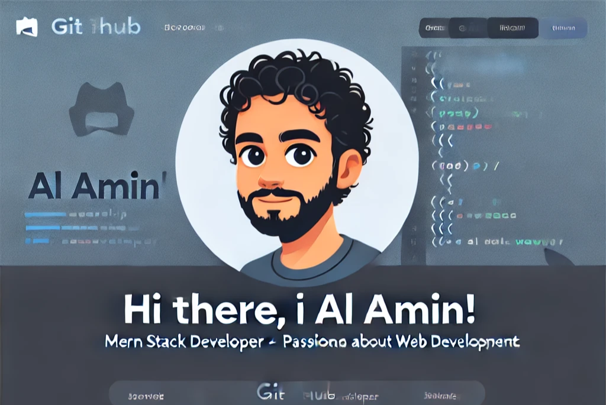

# Hi there, I'm Al Amin! 👋

Welcome to my GitHub profile! I'm a passionate MERN stack developer from Bangladesh, currently based in Doha, Qatar. I love creating intuitive, efficient, and visually appealing web applications. Below, you'll find more about my skills, projects, and how to connect with me.

---

## 🌟 Skills

- **Front-end Development:** HTML5, CSS3, JavaScript, React.js, Next.js, Tailwind CSS, DaisyUI, Bootstrap
- **Back-end Development:** Node.js, Express.js
- **Database:** MongoDB
- **Tools & Platforms:** Firebase, Git, GitHub, Vercel
- **UI/UX Design:** Figma, Photoshop, Sketch, PSD to HTML
- **Libraries & Frameworks:** Chart.js, Canvas.js

---

## 🛠️ Projects

Here are some of the projects I have worked on:

1. **[Gymnasium](https://gymnasiumn.netlify.app/):** A fitness-focused web application.
2. **[Captise](https://captise.netlify.app/):** A modern and engaging project.
3. **[Optimum Health](https://optimum-health-ea895.web.app/):** A platform for health solutions.
4. **[Learnoglance](https://learnoglance.web.app/):** An e-learning platform.
5. **[Hunt](https://hunt-site.netlify.app/):** A feature-rich website.
6. **[The Guardian Copy](https://the-guardian2264.netlify.app/):** A news-oriented website.
7. **[Portfolio Design](https://morgan-portfolio-site.netlify.app/):** A clean and creative portfolio.
8. **[Aromatic Food](https://aromatic-food.netlify.app/):** A delightful food website.

---

## 📫 Connect with Me

- **GitHub:** [github.com/devalamin](https://github.com/devalamin)
- **Portfolio:** [portfolio-2264.netlify.app](https://portfolio-2264.netlify.app/)
- **LinkedIn:** [linkedin.com/in/alamin2264](https://www.linkedin.com/in/alamin2264/)
- **Email:** [alamin.dev.web@gmail.com](mailto:alamin.dev.web@gmail.com)
- **Facebook:** [facebook.com/Alamin2264](https://www.facebook.com/Alamin2264)

---

## 📄 Resume

Check out my resume here: [View Resume](https://drive.google.com/file/d/1a2eV9A9z0qIoOFtEOZqb1sRBmT1sduVl/view)

---

Thank you for visiting my profile! Let's connect and create something amazing together. 🚀
